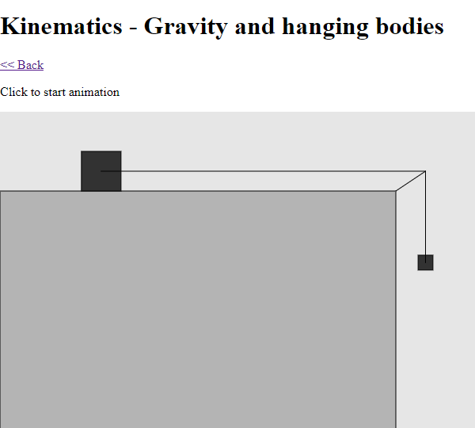
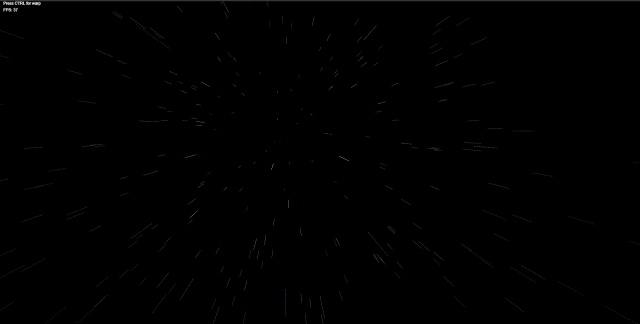
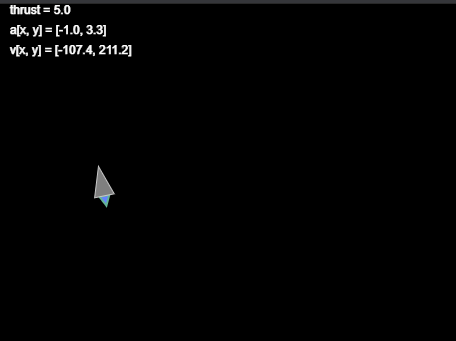
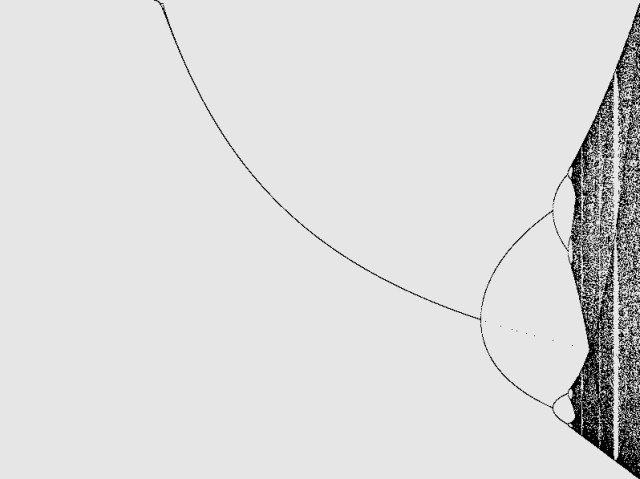
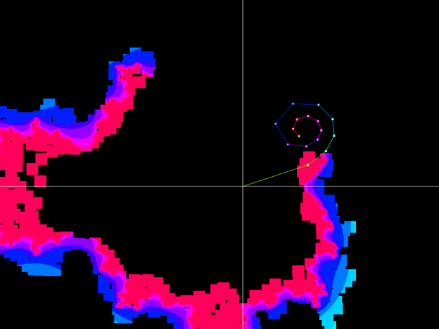
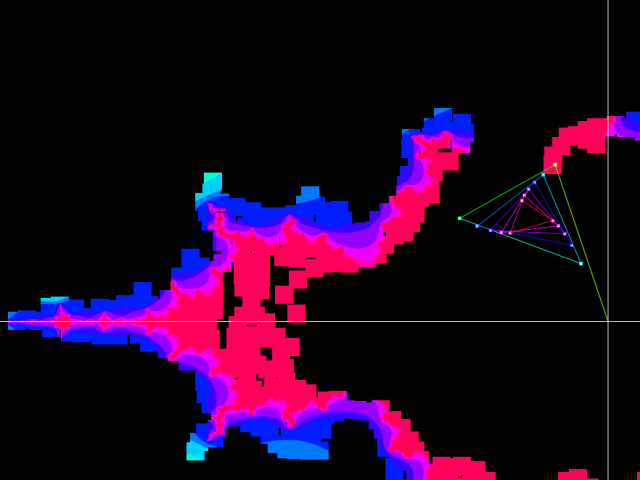

# p5js-scratchpad

A collection of [P5.js](https://p5js.org/) scripts: exercises, experiments... fun!

Please don't take these examples too seriously, as I am by no means a P5.js expert.

See demos at:
https://p5.megadix.it/

## Screenshots

### Physics



### Games





### Chaos

Logistic map:



Mandelbrot Set:


Mandelbrot Set Orbits Explorer:





---

# Developer notes (Skip if you're not interested in deploying this website)

## Project setup

Activate Virtualenv (Windows Powershell):

```
cd [PROJECT FOLDER]
.\venv\Scripts\Activate.ps1
```


```
pip install -r requirements.txt
```

## Deploy to PROD

### Deploy

1) Generate pages in `/output` folder, PROD configuration:

```
pelican -s publishconf.py
```

2) Copy files with FTP
