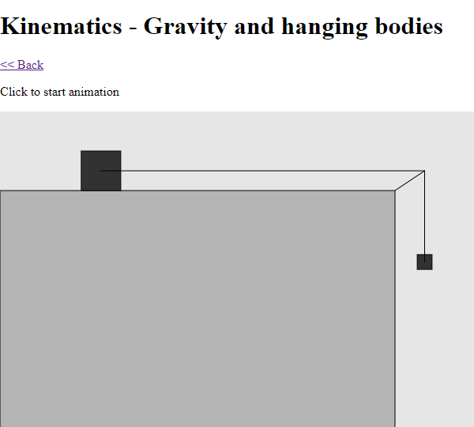
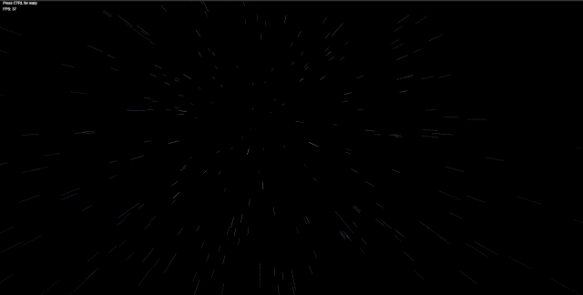
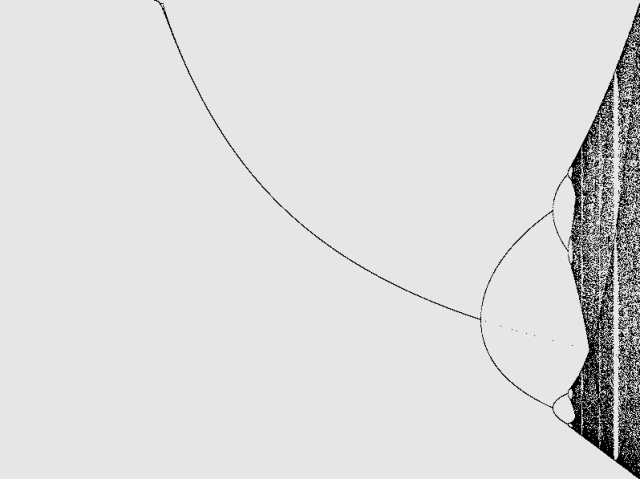
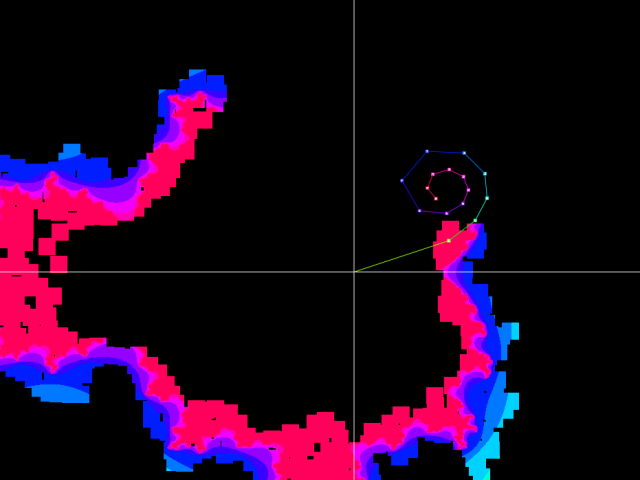

# p5js-scratchpad

A (semi)random collection of [P5.js](https://p5js.org/) scripts: exercises, experiments... fun!

Please don't take these examples too seriously, as I am by no means a P5.js expert.

See demos at:

https://p5js-scratchpad.web.app/

# Quickstart

You can either:

1) open individual .html files
2) (best option) serve files with a local http server

Example of 2) local http server using [serve - Static file serving and directory listing](https://github.com/zeit/serve):

```
npm install -g serve
cd public
serve
```

Then access pages at:  
http://localhost:5000

# Screenshots

## Physics



## Games




## Chaos

Logistic map:



Mandelbrot Set:


Mandelbrot Set Orbits Explorer:




