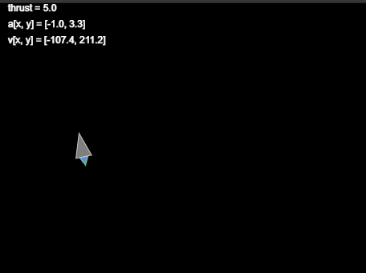

# p5js-scratchpad

A (semi)random collection of [P5.js](https://p5js.org/) scripts: exercises, experiments... fun!

Please don't take these examples too seriously, as I am by no means a P5.js expert.

See demos at:

https://p5js-scratchpad.web.app/

# Quickstart

You can either:

1) open individual .html files
2) (best option) serve files with a local http server

Example of 2) local http server using [serve - Static file serving and directory listing](https://github.com/zeit/serve):

```
npm install -g serve
cd public
serve
```

Then access pages at:  
http://localhost:5000

# Screenshots

## Physics


## Games




## Chaos

Logistic map:


Mandelbrot Set:


Mandelbrot Set Orbits Explorer:


# Developer Notes (Skip if you're not interested in deploying this website)

This app was created using [create-react-app](https://create-react-app.dev/), see [README-create-react-app.md](README-create-react-app.md) for detailed documentation, developer guides, etc.

## Technology Stack

- [React](https://reactjs.org/): core UI library
- [React Router](https://reactrouter.com/): routing library for React
- [Bootstrap](https://getbootstrap.com/): CSS Framework
- [React Bootstrap](https://react-bootstrap.github.io/): React bindings for Bootstrap

Testing / development:

- [Storybook](https://storybook.js.org/): visual UI testing toolkit for developing UI components in isolation
- [react-testing-library](https://github.com/testing-library/react-testing-library): testing library for components
- [Jest](https://jestjs.io/): testing library and executor

## Project Setup

### Prerequisite

- [Node.js](https://nodejs.org/en/)
- [Yarn Package Manager](https://yarnpkg.com/)

### Setup

1) Start local server:

```
yarn start
```

2) access application:

http://localhost:3000/

### Testing:

Execute tests:

```
yarn test
```

Start Storybook server:

```
yarn storybook
```

Access Storybook at:

http://localhost:6006/

## Deploy

- Note: **this works with MY Firebase-hosted project**, in order to use it on your own project  you need to modify `.firebaserc` file in project root!!!
- install [Firebase Tools](https://firebaseopensource.com/projects/firebase/firebase-tools/)
- generate a `FIREBASE_TOKEN`

```
firebase login:ci
```

Then store the generated token as `FIREBASE_TOKEN` in your GitHub repo -> Settings -> Secrets

Each push to `master` will trigger "Deploy" action configured in `.github`
